## 介绍

本文记录了我使用uni-app开发构建并发布跨平台移动应用的全过程，旨在帮助新手开发者掌握如何使用uni-app进行APP开发并最终成功上架。通过详细讲解从注册开发者账号、项目创建、打包发布到应用商店配置的每一步骤，希望我的经验分享能为您提供实用的指导和帮助，让您在开发之旅中少走弯路，顺利实现自己的应用开发目标。

## 环境配置

### IOS 环境配置

#### 注册开发者账号 

如果没有开发者账号需要注册苹果开发者账号，并且加入 “iOS Developer Program”，如果是公司项目那么可以将个人账号邀请到公司的项目中。

#### 获取开发证书和配置文件

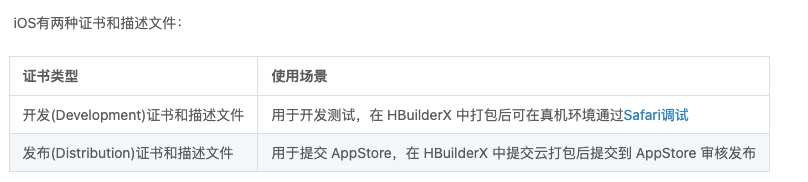

登录[Apple Developer](https://developer.apple.com/)找到创建证书入口


申请证书的流程可以参考Dcloud官方的教程，[申请ios证书教程](https://ask.dcloud.net.cn/article/152)

开发证书和发布证书描述文件都申请好应该是这个样子

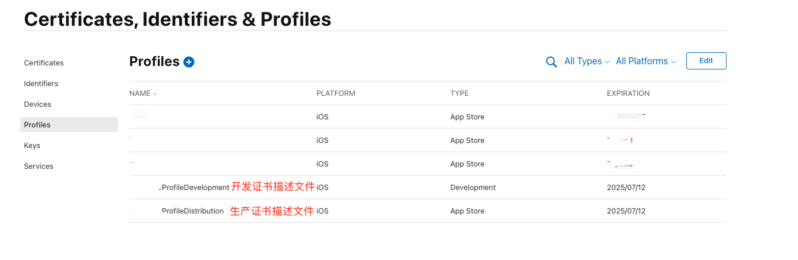

#### 创建App ID

创建一个App ID。App ID是iOS应用的唯一标识符，稍后你会在uni-app项目的配置文件中使用它。

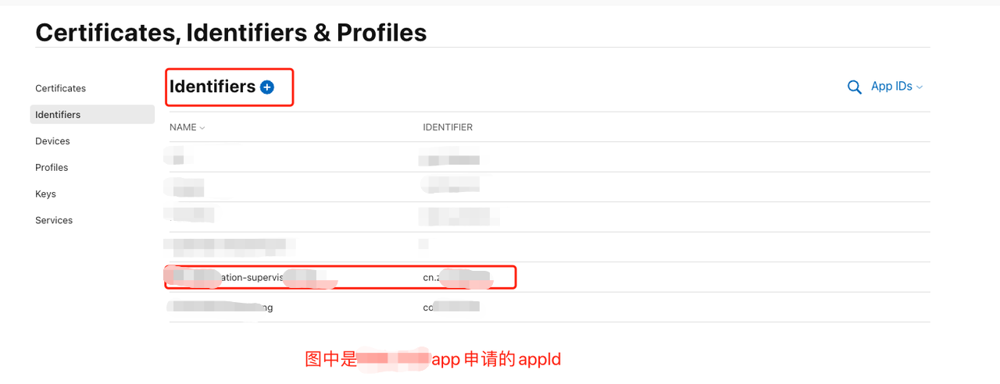

#### 配置测试机

第一步打开开发者后台点击Devices

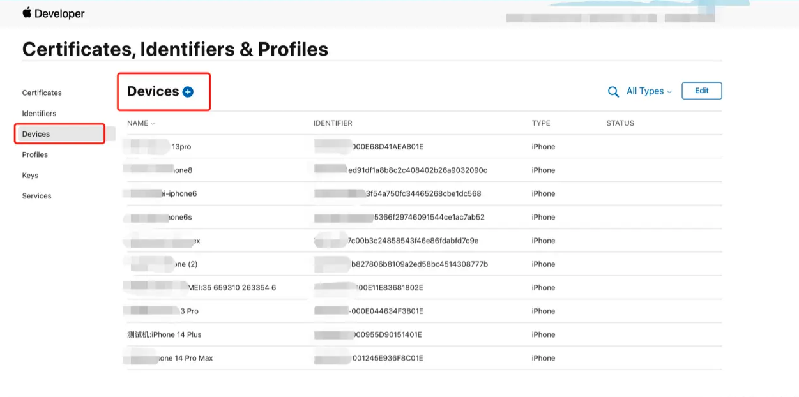

第二步填写UDID

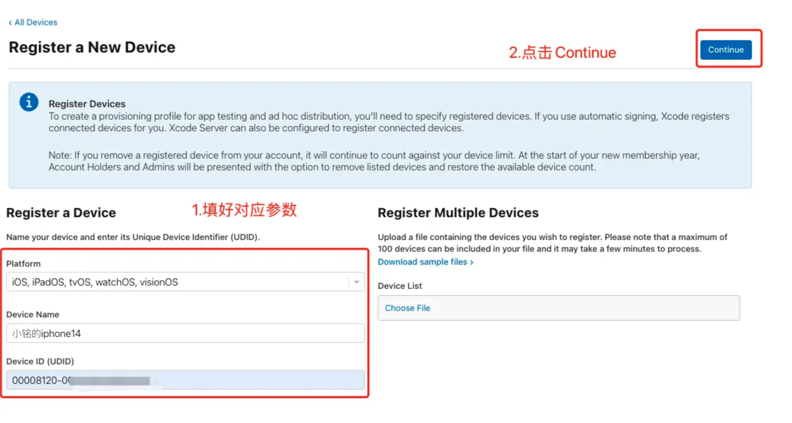

第三步重新生成开发证书并且勾选新增的测试机，建议一次性将所有需要测试的手机加入将来就不用一遍遍重复生成证书了

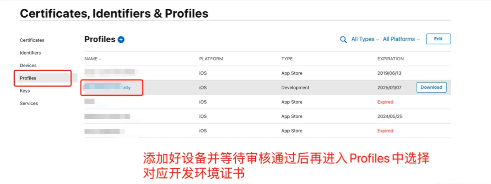

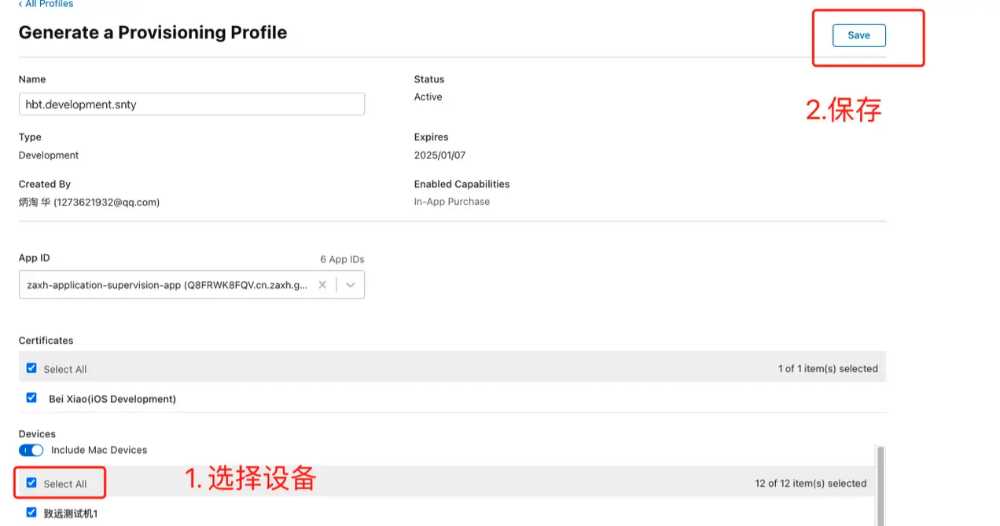

### Android 环境配置

#### 生成证书

Android平台签名证书(.keystore)生成指南： <https://ask.dcloud.net.cn/article/35777>

### uni-app 项目构建配置

#### 基础配置

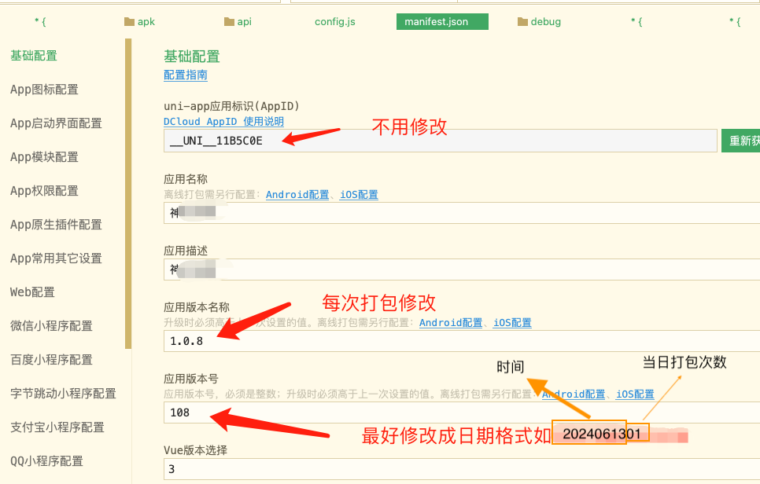

版本号versionCode 前八位代表年月日，后两位代表打包次数

#### APP 图标设置

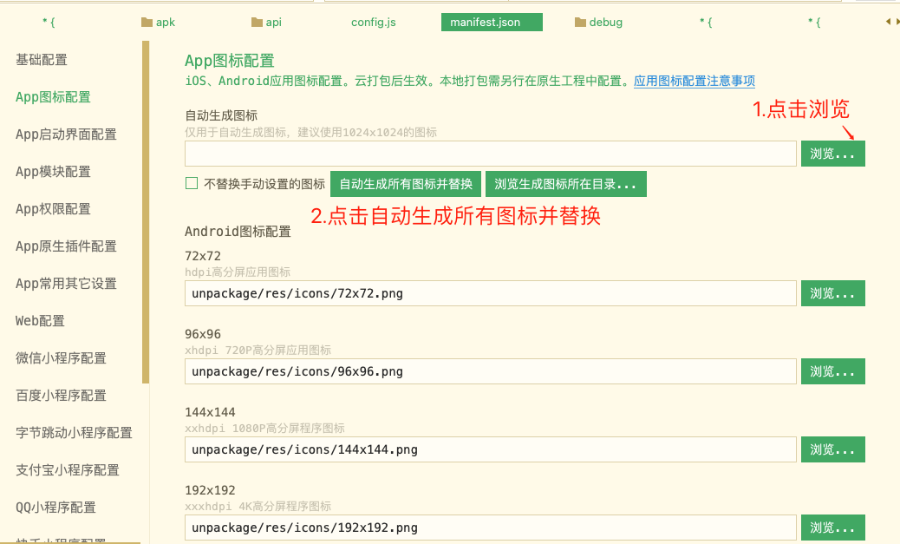

#### APP启动界面配置

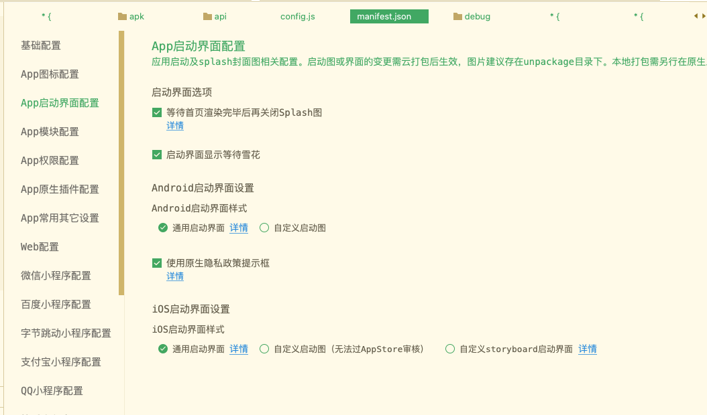

#### App模块配置

注意这个页面用到什么就配置什么不然会影响APP审核

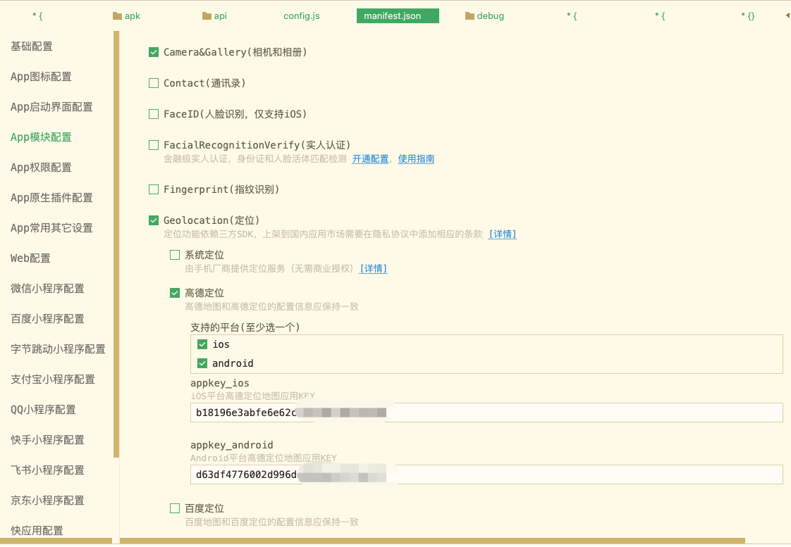

#### App隐私弹框配置

> 注意根据工业和信息化部关于开展APP侵害用户权益专项整治要求应用启动运行时需弹出隐私政策协议，说明应用采集用户数据，这里将详细介绍如何配置弹出“隐私协议和政策”提示框

[详细内容可参考Uni官方文档](https://uniapp.dcloud.net.cn/tutorial/app-privacy-android.html)
**注意！androidPrivacy.json不要添加注释，会影响隐私政策提示框的显示！！！**

在app启动界面配置勾选后会在项目中自动添加androidPrivacy.json文件，可以双击打开自定义配置以下内容：

```js
{
    "version" : "1",
    "prompt" : "template",
    "title" : "服务协议和隐私政策",
    "message" : "　　请你务必审慎阅读、充分理解“服务协议”和“隐私政策”各条款，包括但不限于：为了更好的向你提供服务，我们需要收集你的设备标识、操作日志等信息用于分析、优化应用性能。<br/>　　你可阅读<a href="https://xxx.xxx.com/userPolicy.html">《服务协议》</a>和<a href="https://xxxx.xxxx.com/privacyPolicy.html">《隐私政策》</a>了解详细信息。如果你同意，请点击下面按钮开始接受我们的服务。",
    "buttonAccept" : "同意并接受",
    "buttonRefuse" : "暂不同意",
    "hrefLoader" : "system|default",
    "backToExit" : "false",
    "second" : {
        "title" : "确认提示",
        "message" : "　　进入应用前，你需先同意<a href="https://xxx.xxxx.com/userPolicy.html">《服务协议》</a>和<a href="https://xxx.xxxx.com/userPolicy.html">《隐私政策》</a>，否则将退出应用。",
        "buttonAccept" : "同意并继续",
        "buttonRefuse" : "退出应用"
    },
    "disagreeMode" : {
        "loadNativePlugins" : false,
        "showAlways" : false
    },
    "styles" : {
        "backgroundColor" : "#fff",
        "borderRadius" : "5px",
        "title" : {
            "color" : "#fff"
        },
        "buttonAccept" : {
            "color" : "#22B07D"
        },
        "buttonRefuse" : {
            "color" : "#22B07D"
        },
        "buttonVisitor" : {
            "color" : "#22B07D"
        }
    }
}
```

我的隐私协议页面是通过vite打包生成的多入口页面进行访问，因为只能填一个地址所以直接使用生产环境的例如：<https://xxx.xxxx.com/userPolicy.html>

## 构建打包

使用HBuilderX进行云打包

### IOS打包

#### 构建测试包

第一步 点击发行->原生app云打包

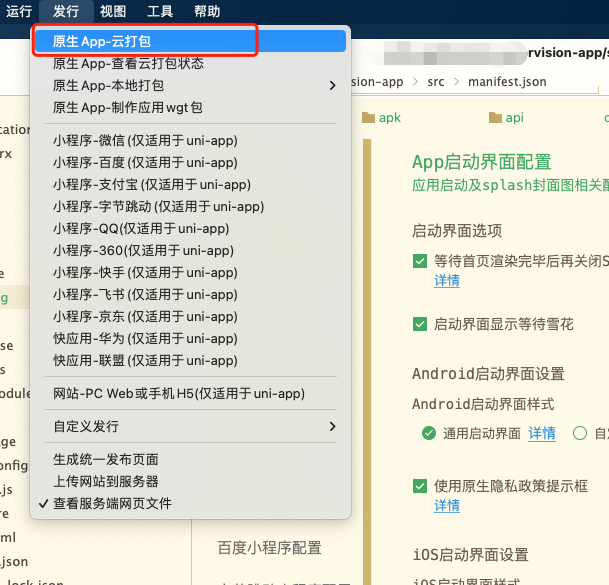

第二步配置打包变量

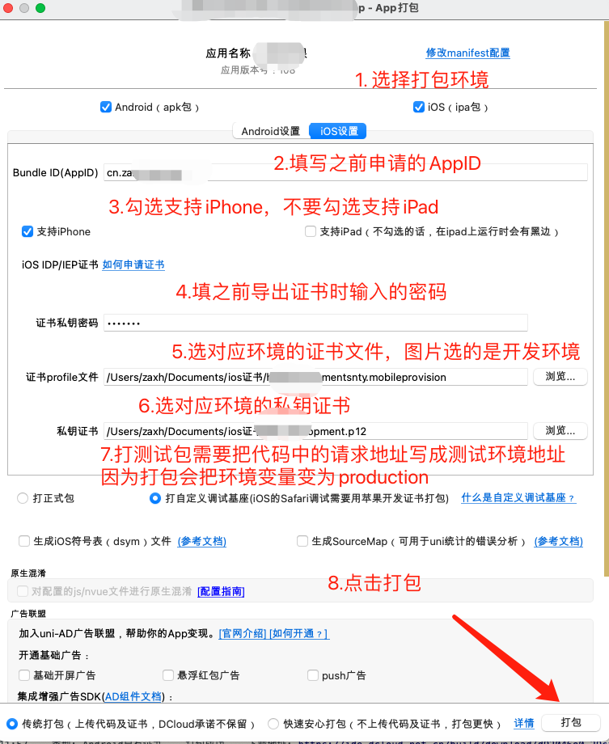

##### 运行测试包

打开HbuildX->点击运行->运行到IOS App基座

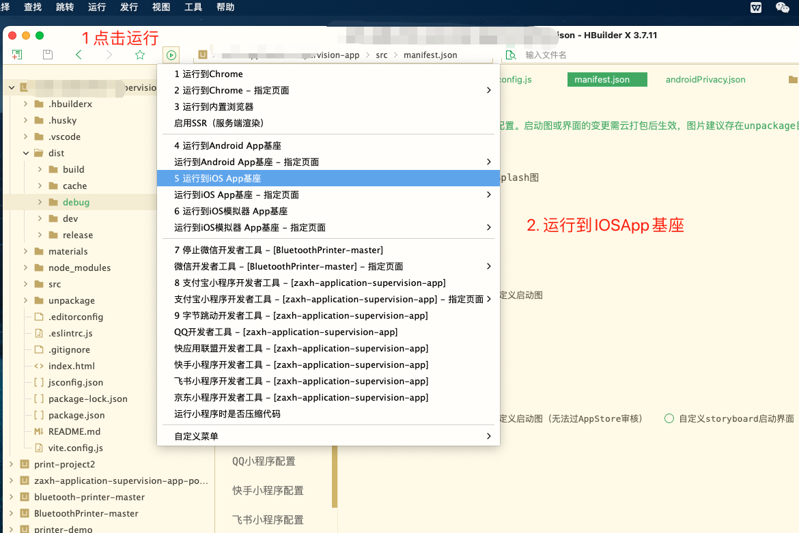
选择设备->使用自定义基座运行

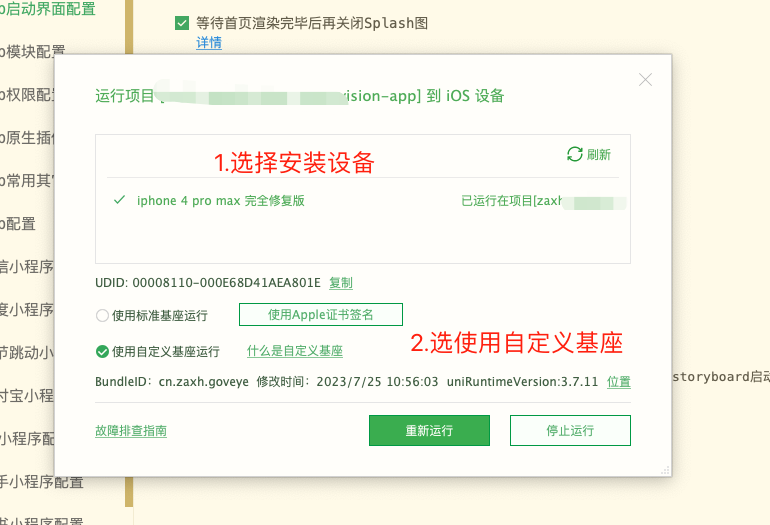

#### 构建生产包

和构建测试包基本差不多，需要变更的就是ios证书的profile文件和密钥证书

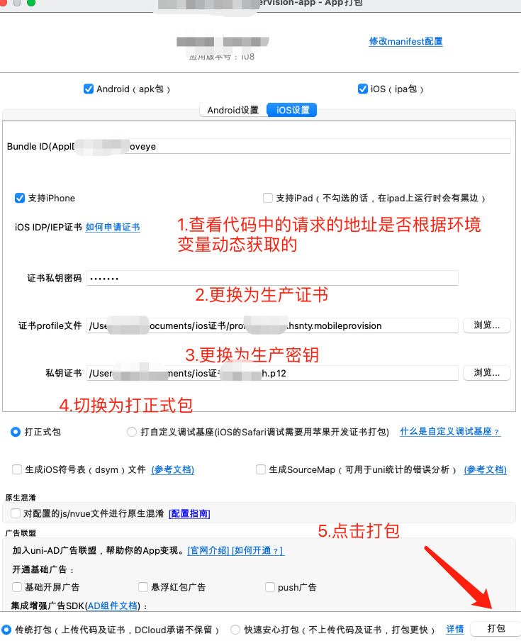

构建成功后的包在dist目录下release文件夹中

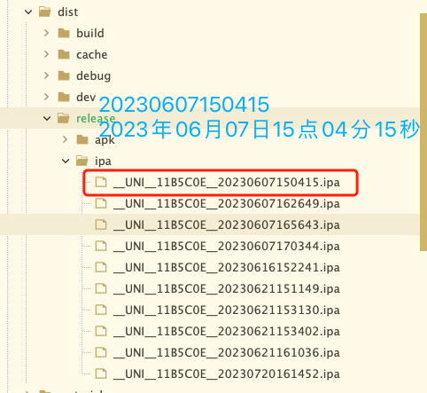

#### 上传生产包

上传IOS安装包的方式有很多我们选择通过transporter软件上传，下载transporter并上传安装包

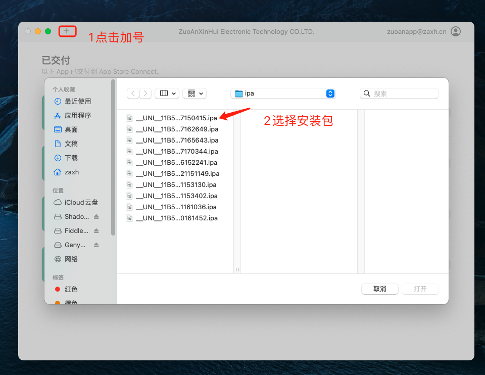

确认无误后点击交付，点击交付后刷新后台，一般是5分钟左右就可以出现新的包了。

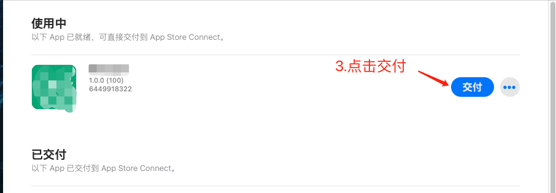

#### App store connect 配置

##### 上传截屏

只要传6.5和5.5两种尺寸的就可，注意打包的时候千万不能勾选支持ipad选项，不然这里就会要求上传ipad截屏

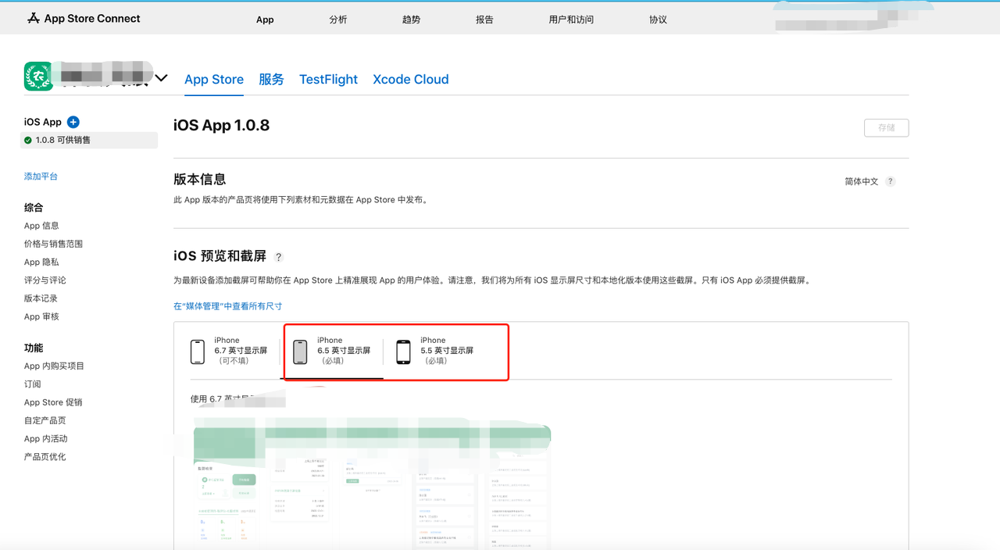

##### 填写app信息

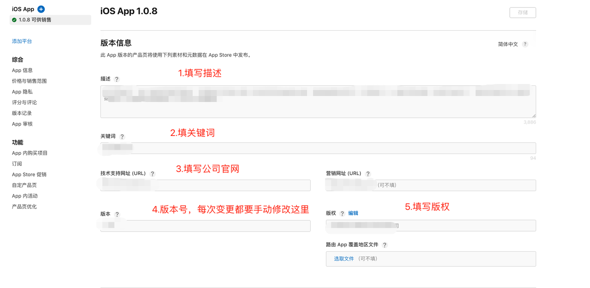

##### 配置发布方式

自动发布会在审核完成后直接发布，建议选手动发布

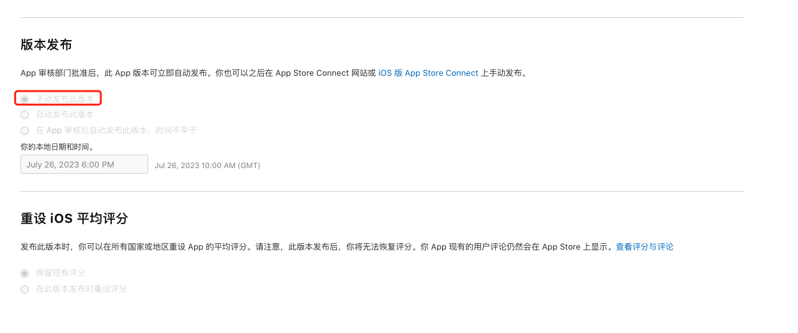

##### 配置销售范围


##### 配置隐私政策

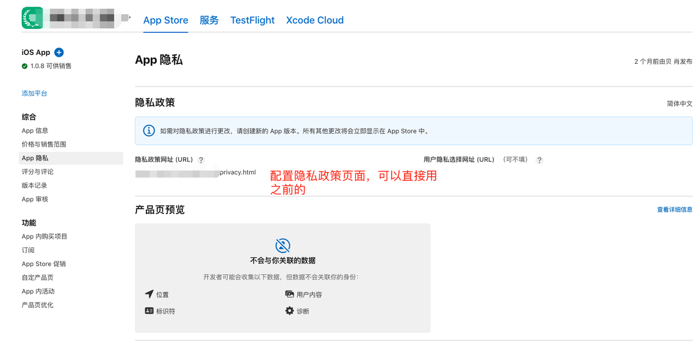

配置完之后IOS就可以提交审核了，不管审核成功还是失败Apple都会发一封邮件通知你审核结果

### 安卓打包

#### 构建测试包

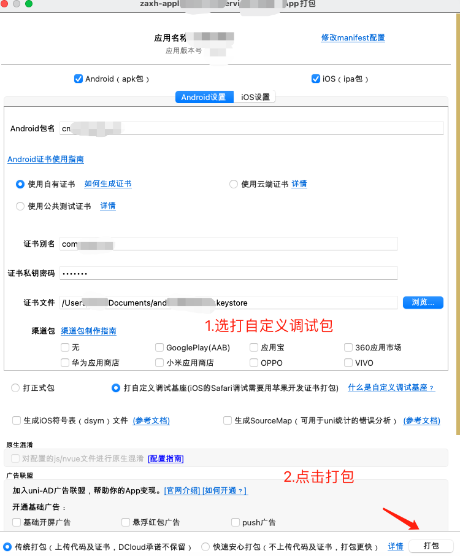

构建的包在dist/debug目录下

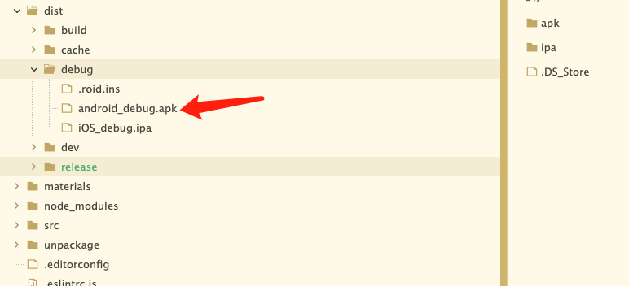

##### 运行测试包

如果需要运行的话，点击运行 -> 运行到Android App底座

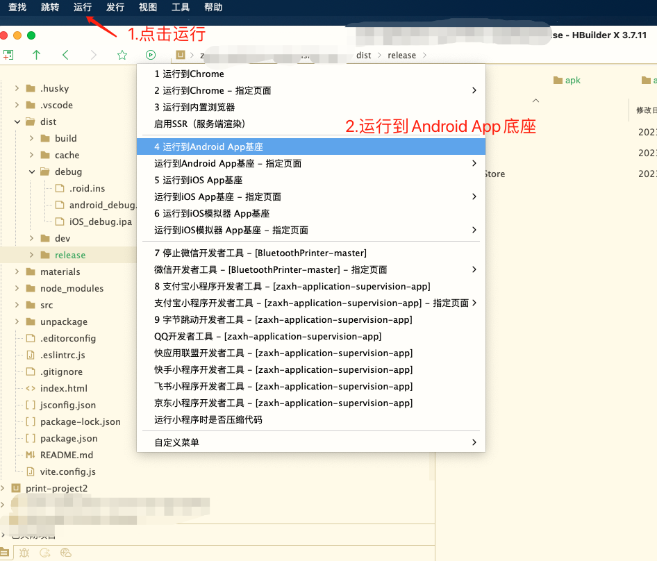

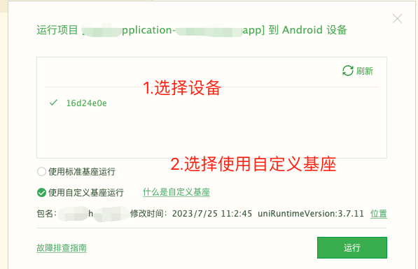

#### 构建生产包

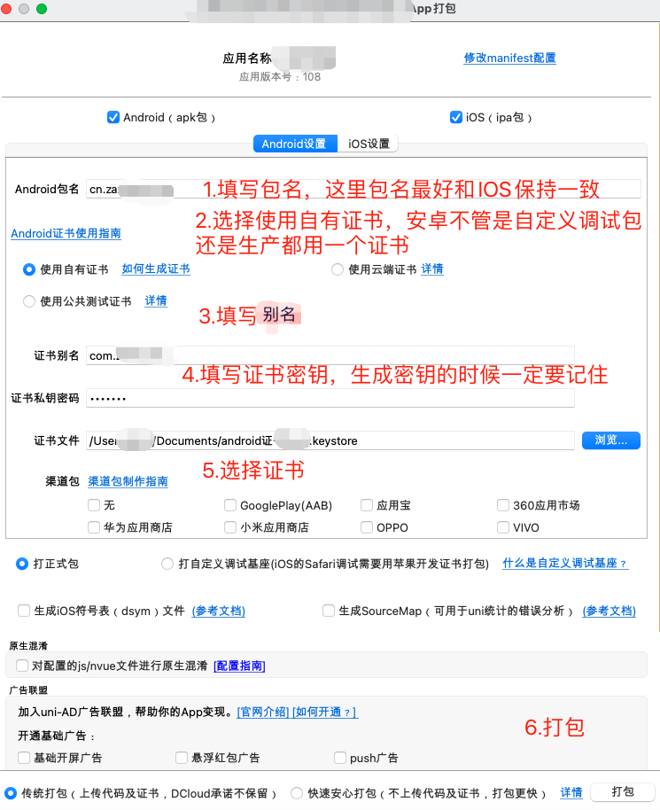

构建后的包在dist目录下release文件夹中

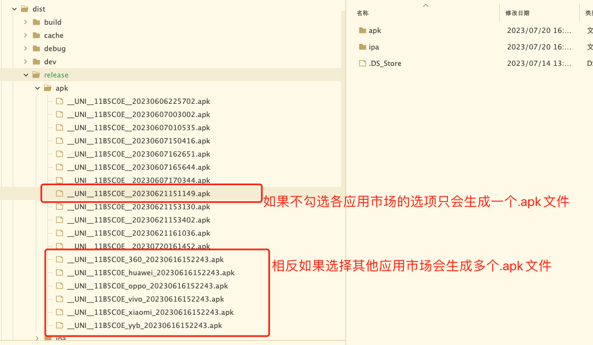

构建好安卓包之后就可以在国内的各大手机厂商的应用商店上架了，由于安卓市场平台五花八门就不给大家一一列举了。

## 参考链接:

- [申请ios证书教程](https://ask.dcloud.net.cn/article/152)
- [Android平台签名证书(.keystore)生成指南](https://ask.dcloud.net.cn/article/35777)
- [Android平台隐私政策配置](https://uniapp.dcloud.net.cn/tutorial/app-privacy-android.html)

## 结语
本文介绍了使用uni-app开发并发布跨平台移动应用的完整流程，包括注册开发者账号、项目创建、打包发布以及应用商店配置，帮助开发者高效地将应用上架到iOS和Android平台。感谢您的阅读，希望本文能对您有所帮助。