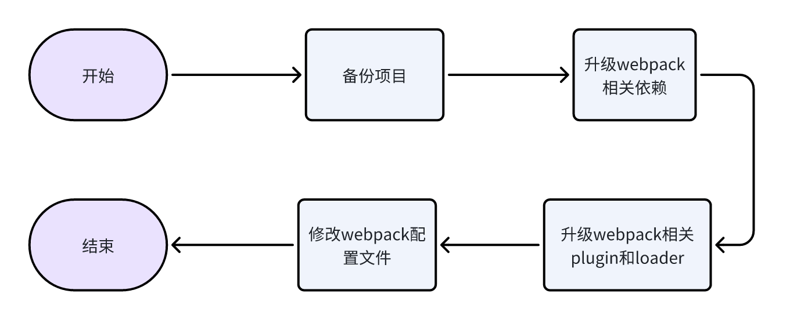
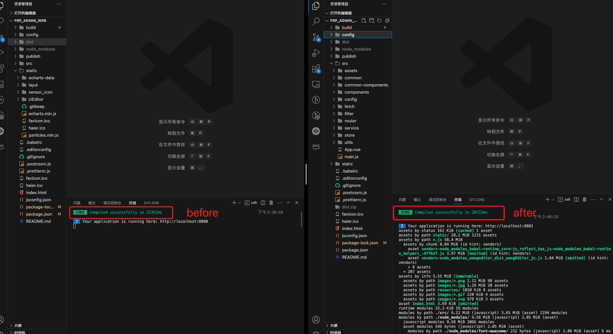
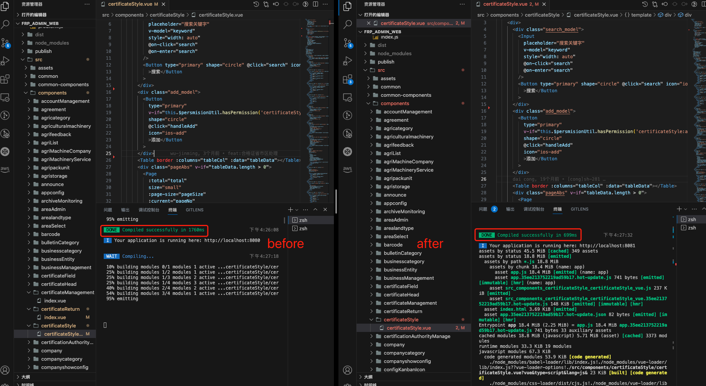
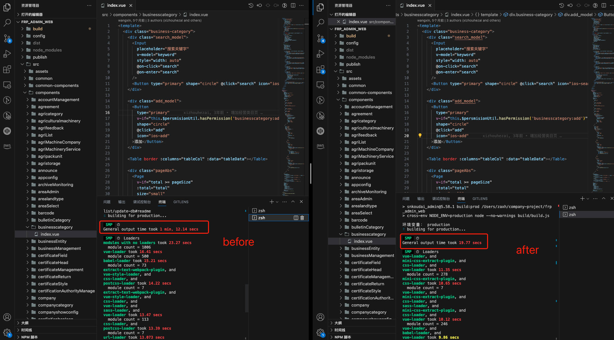

## 背景
众所周知把一个大象装冰箱需要三步，升级一个老项目的webpack需要几步呢？由于是4年的老项目采用 vue2 和 webpack3 构建的，随着时间的推移项目的不断迭代，页面文件数量日益增长打包和运行耗费的时间也逐渐增加，已经严重影响到了开发体验和开发效率，所以优化也就被提上日程。但一次把所有的地方都升级一遍不太现实而且风险也比较大，所以选择逐步升级和优化是一个很好的解决办法。我打算先将打包工具进行升级，毕竟过去了4年 webpack 已经迭代了很多个版本让我们看看 webpack5 会有怎样的表现吧。

## 升级流程图



## 准备工作
- 备份项目（备份永远是最重要的哪怕没做成也不至于项目搞黄）。
- 记录之前项目中的 Node 版本（方便在回滚的时候知道当时的Node环境）。
- 升级 Node.js Webpack 5 对 Node.js 的版本要求至少是 10.13.0。

## 依赖配置表

<table border="2" >
	<tr>
		<td>Package Name</td>
		<td>Old Version</td>
		<td>New Version</td>
		<td>Version Status</td>
	</tr>
	<tr>
		<td>webpack</td>
		<td>3.12.0</td>
		<td>5.88.2</td>
		<td>升级</td>
	</tr>
	<tr>
		<td>webpack-cli</td>
		<td>3.2</td>
		<td>5.1.4</td>
		<td>升级</td>
	</tr>
	<tr>
		<td>webpack-dev-server</td>
		<td>2.11.5</td>
		<td>4.15.1</td>
		<td>升级</td>
	</tr>
	<tr>
		<td>webpack-merge</td>
		<td>4.1.0</td>
		<td>5.9.0</td>
		<td>升级</td>
	</tr>
	<tr>
		<td>css-loader</td>
		<td>0.28.0</td>        
		<td>6.8.1</td>
		<td>升级</td>
	</tr>
	<tr>
		<td>friendly-errors-webpack-plugin</td>
		<td>1.6.1</td>
		<td>1.7.0</td>
		<td>升级</td>
	</tr>
	<tr>
		<td>html-webpack-plugin</td>
		<td>2.30.1</td>
		<td>5.5.3</td>
		<td>升级</td>
	</tr>
	<tr>
		<td>style-loader</td>
		<td>1.2.1</td>
		<td>3.3.3</td>
		<td>升级</td>
	</tr>
	<tr>
		<td>vue-loader</td>
		<td>13.3.0</td>
		<td>15.10.1</td>
		<td>升级</td>
	</tr>
	<tr>
		<td>vue-template-compiler</td>
		<td>2.6.10</td>
		<td>2.7.14</td>
		<td>升级</td>
	</tr>	
	<tr>
		<td>clean-webpack-plugin</td>
        <td>--</td>
		<td>4.0.0</td>
		<td>新增</td>
	</tr>
	<tr>
		<td>cross-env</td>
        <td>--</td>
		<td>7.0.3</td>
		<td>新增</td>
	</tr>
	<tr>
		<td>css-minimizer-webpack-plugin</td>
        <td>--</td>
		<td>5.0.1</td>
		<td>新增</td>
	</tr>
	<tr>
		<td>speed-measure-webpack-plugin</td>
        <td>--</td>
		<td>1.5.0</td>
		<td>新增</td>
	</tr>
	<tr>
		<td>mini-css-extract-plugin</td>
        <td>--</td>
		<td>2.4.0</td>
		<td>新增</td>
	</tr>
	<tr>
		<td>url-loader</td>
		<td>--</td>
		<td>--</td>
		<td>删除</td>
	</tr>
	<tr>
		<td>file-loader</td>
		<td>--</td>
		<td>--</td>
		<td>删除</td>
	</tr>
	<tr>
		<td>optimize-css-assets-webpack-plugin</td>
		<td>--</td>
		<td>--</td>
		<td>删除</td>
	</tr>
	<tr>
		<td>extract-text-webpack-plugin</td>
		<td>--</td>
		<td>--</td>
		<td>删除</td>
	</tr>
	<tr>
		<td>vue-style-loader</td>
		<td>--</td>
		<td>--</td>
		<td>删除</td>
	</tr>
</table>

## 升级 webpack5 
### 升级 webpack 至最新的可用版本。
当前 webpack 最新版本 5.88.2。

### 升级 webpack-cli 到最新的可用版本。
当前 webpack-cli 最新版本 5.1.4。

### 升级所有使用到的 plugin 和 loader 为最新的可用版本。
- webpack-dev-server 2.11.5 -> 4.15.1
- webpack-merge 4.1.0 -> 5.9.0
- css-loader 0.28.0 -> 6.8.1
- friendly-errors-webpack-plugin 1.6.1 -> 1.7.0
- html-webpack-plugin	2.30.1 -> 5.5.3
- style-loader	1.2.1 -> 3.3.3
- vue-loader	13.3.0 -> 15.10.1
- vue-template-compiler	2.6.10	-> 2.7.14

###  移除所有废弃的 plugin 和 loader。
- url-loader
- file-loader
- optimize-css-assets-webpack-plugin
- extract-text-webpack-plugin
- vue-style-loader

### 新增所有使用到的 plugin 和 loader。
- clean-webpack-plugin 4.0.0
- cross-env 7.0.3
- css-minimizer-webpack-plugin 5.0.1
- speed-measure-webpack-plugin 1.5.0
- mini-css-extract-plugin 7.0.3

## 具体配置

### 修改webpack运行方式
webpack 运行方式需要改为 webpack server，并在打包命令的同时通过 cross-env 注入环境变量。
```json
"scripts": {
		"dev": "cross-env NODE_ENV=development npx webpack server --config build/webpack.dev.conf.js",
		"build": "webpack --config ./build/webpack.prod.js",
		"build:testb": "cross-env NODE_ENV=develop-testb node --no-warnings build/build.js",
}
```

### webpack.base.conf.js 配置
#### 清理配置
- 移除 context 配置项。
- 新增 mode 设置 mode = 'development'。
- 移除 node 配置项。

#### 配置 rules
- 引入 vue-loader，移除 vue-loader.conf.js 配置文件。
- 移除 url-loader 使用 webpack5自带 asset/resource 模块解析图片字体等静态资源。
- 使用 mini-css-extract-plugin 压缩 css（开发环境下关闭）。
- 使用 dart-sass 替换 node-sass（解决 Node.js 版本必须和 node-sass 对应问题常常因为项目较多在多个项目切换过程中需要频繁切换 NodeJS 版本，以及经常因为网络不稳定导致安装失败等问题）。

### webpack.dev.conf.js 配置
#### 清理配置
- 改变 webpack-merge 引入方式。
- 设置 mode = 'development'。
- 配置 watchOptions.poll = 1000 （每秒监听一次文件变化）。

#### 配置 devServer 
- publicPath 迁移到 devServer.static 对象下。
- overlay 属性移动到 devServer.client 对象下。
- 移除 watch、hot、module.rules、clientLogLevel、contentBase、quiet 等配置。

#### 配置 plugins 
- 弃用 webpack.NamedModulesPlugin。
- 移除 webpack.DefinePlugin 环境变量通过 cross-env 在 package.json 的 scripts 对象下设置。
- 新增 MiniCssExtractPlugin 将 CSS 提取到单独的文件中。

#### 配置 optimization
-  在 minimizer 对象下新增 CssMinimizerPlugin 这个插件使用 cssnano 优化和压缩 CSS。

### webpack.prod.conf.js 配置
#### 清理配置
- 为了追求生产打包速度配置 devtool = 'eval'。

#### 配置 plugins
- 移除 uglifyjs-webpack-plugin 插件使用 terser-webpack-plugin 压缩js。
- 移除 extract-text-webpack-plugin 和 optimize-css-assets-webpack-plugin。
- 配置 mini-css-extract-plugin 压缩 css。
- 新增 speed-measure-webpack-plugin 插件查看打包花费时长。

#### 配置 optimization
- 在 optimization.minimizer 对象下使用 terser-webpack-plugin 插件开启多线程压缩 js 并配置删除注释和日志。
- 在 optimization.minimizer 对象下使用 css-minimizer-webpack-plugin 插件压缩 css。

## 升级后表现

开发环境运行表现: 升级前运行时间 32s 升级后运行时间 20s 总时间减少了12s 运行速度提升 37%



热替换表现: 升级前改动代码 1760ms 升级后改动代码运行时间 699ms 总时间减少 1061ms 速度提升 60%



打包表现: 升级前打包用时 1m12s 升级后打包用时 19s 总时间减少 53s 速度提升 73%



## 写在最后
那么回到文章开始时我提出的问题，升级一个老项目的 webpack 需要几步呢？如果你耐心看完的话相信你肯定可以不假思索的回答上来。我们从备份项目和 Node.js 版本到升级 webpack 接着升级了和 webpack 相关的 plugin 和 loader 最后修改了 webpack 的配置文件至此我们完成了整个 webpack 的升级，想想还有点小激动呢。
如果你所参与的项目恰好和博主有类似的情况不妨可以尝试一下喔。

最后，感谢您阅读这篇文章，有任何问题或反馈请给我留言，如果这篇文章对你有所帮助请给我一个三连支持一下，哪怕是一个免费的赞呢。
